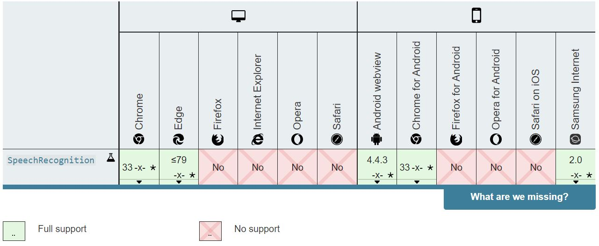
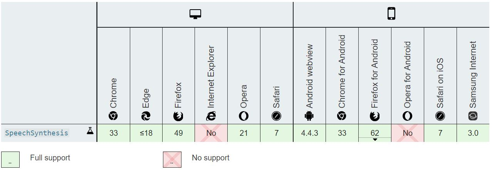

## Skip if you don't like Intros - 
From Google Assistant to Apple's Siri, from Amazon's Alexa to Microsoft's Cortana, everywhere voice recognition is being used. Be it for searching something, or asking some questions, everyone enjoys a Hands-Free experience!!

Did you know, even our websites can be integrated with Speech Recognition system? Just by using some commands, we can operate our websites, Change themes and even get Text to Voice Output.

In this tutorial, we will walkthrough the process for setting up Speech Recognition using Web Speech API in JavaScript.

Now without further much wait, let's get started -

### Prerequisites - 
* IDE installed for JavaScript/ You can also use [Repl.it](https://repl.it/) as an online IDE.
* Basic knowledge of JavaScript. (Refer my previous [blog](https://prakhar10varshney.hashnode.dev/building-a-friends-quiz-using-javascript) for an overview of JavaScript.
* And as always, The enthusiasm to learn!

### Understanding Web Speech API -
As the name suggests Web Speech is basically an API for handling voice/texts commands.  
It has 2 parts: 
1. Speech Recognition (Voice to text)
2. Speech Synthesis   (Text to Speech)

_Note - The API is not compatible with all the browsers. The compatibility chart is given below._

Compatibility for `Speech Recognition` -



Compatibility for `Speech Synthesis` -



### Setting up -
First of all, we start by setting the recognition interface to `Speech Recognition` :

``` js
const SpeechRecognition = window.SpeechRecognition || window.webkitSpeechRecognition;
const recognition = new SpeechRecognition();
```

### Function for firing the Speech Recognition - 
Now, we define the function for starting the Speech Recognition-

```js
recognition.onstart = function(){
    console.log("The Recognition has fired, start speaking!");
}
```

_Note - The console.log command will print the specified statement in the console(Can be seen by Inspect page or `Ctrl + Shift + I`)_

### Function to handle the result of Recognition -
After we are done speaking, The `onresult` event handler returns a `SpeechRecognitionEvent` with a property results which is a two-dimensional array. To use these results we define a `recognition.onresult` function, as shown below -

```js
recognition.onresult = function(event){
    var transcript = event.results[0][0].transcript; 
    document.querySelector("#OutputBox").textContent = transcript;

recognition.start();
```

The `event.results` matrix returned, contains the converted Speech as its 1st object named `transcript`.

By the help of `querySelector`, We are able to get the ID of an element present in our HTML code and we can print the results in that element, so as to show it on the user's screen.

The `recognition.start()` is used to start the recognition.

### Finishing up-
The Speech recognition with just Speech-to-Text may seem a bit less useful, but integrating it with other ideas can make User Experience, a lot better. 
For example, It can used to
- Fill forms, without actually typing each and every details.
- Change Themes by just using the specified keyword.
- Copy and Paste texts from One part of website to another.

### What's Next?
If you have followed this article till here, I'm sure you were able to integrate the Speech Recognition successfully.

If you liked the article and found it to be of a little use to you, award me with a Heart❤.

Also, Stay tuned for more tutorials, as in the next one I'll be integrating Speech Recognition for making an Awesome Web Application!

#### Sources -
[MDN web docs](https://developer.mozilla.org/en-US/docs/Web/API/Web_Speech_API)
