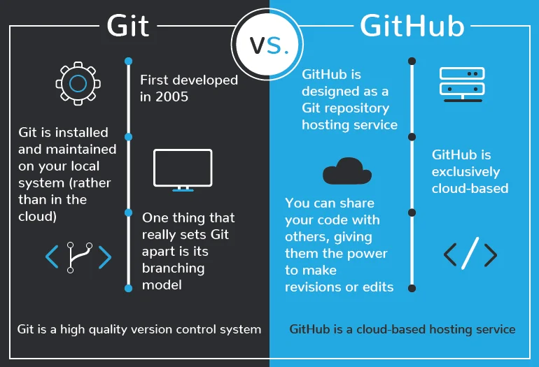
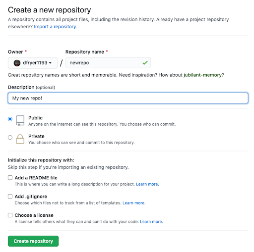

### Hate Intros? Feel free to skip this one!
I'm sure as a beginner programmer, You'd have seen or heard the word 'Git' or 'GitHub' **a lot!** and it might have felt overwhelming to you. Well, Let me tell you, It's not! Once you get the basic understanding of GitHub, I'm sure nothing would feel as easy as Git and you would love using it! 

Now, Let me tell you, that you can use Git GUIs (Graphical User Interface)which is super-easy, But then you won't be doing justice to your **Programmer's Pride**. Well, in that case, we use Command Line Git. 

P.S. It's not just about Programmer's Pride, Command Line Git also provides much control over various functions, which we will discuss ahead.

So, Let's Get Started.

### Step 0: Installing Git and Creating a GitHub account
So, first of all, you need to install Git on your system. You can get the Installation Guide [here](https://git-scm.com/book/en/v2/Getting-Started-Installing-Git).

Now, Create a free account at [GitHub](https://github.com/).

### Step 1: Understanding Git and GitHub -


**Git** is a free and open source distributed version control system designed to handle everything from small to very large projects with speed and efficiency. 
Basically, it is used to track all the changes that you made to your code, and revert back to a certain version, if you want to. 
Git also makes collaboration easier, allowing changes by multiple people to all be merged into one source.

**GitHub** on the other hand, lets you store your code on a cloud server, so that it can be easily accessed by other programmers online.
It’s an online database that allows you to keep track of and share your Git version control projects outside of your local computer/server.

With a basic knowledge of git and GitHub, let's move forward.

### Step 2: Setting up our identity -
The first and foremost step after installing Git is setting our name and email address. Because every Git commit uses this information, and it’s immutably baked into the commits we start creating:
```shell
$ git config --global user.name "PV"
$ git config --global user.email PV@example.com
```

### Step 3: Creating a local Git Repository -

> 
A Git repository is the . git/ folder inside a project. This repository tracks all changes made to files in your project, building a history over time.

To begin, open up a terminal and move to where you want to place the project on your local machine and right click to open `Git BASH Here`.

To initialize a git repository in the root of the folder, run the git init command:
```shell
$ git init
Initialized empty Git repository in /Users/pv/myproject/.git/
```

### Step 4: Creating and adding a file to Staging Area:
Before we add a file, let's see the basic workflow :


> 
The working area is where files that are not handled by git. These files are also referred to as "untracked files." Staging area is files that are going to be a part of the next commit, which lets git know what changes in the file are going to occur for the next commit. The "commit" command is used to save your changes to the local repository.

So, in order to proceed with this tutorial, create a file named `index.txt`. This file is currently in the working area. 
Now we will add this file to the staging area using the `git add` command, followed by the `git commit` command to commit the changes:
```shell
$ git add index.txt
$ git commit -m 'Add: Initial project version'
``` 
*Note : Commit messages are very important in the long run. Later if you want to revert back to a certain version, the commit message makes it easier for us to remember the version.*

### Step 5: Checking the Status of our files:
We use the `git status` command to check which files are in staging area, and which are untracked file:
```shell
$ git status
On branch master

No commits yet

Changes to be committed:
  (use "git rm --cached <file>..." to unstage)
        new file:  index.txt
```

### Step 6: Creating a new repository on GitHub -
This step is really simple and self-explanatory. We just have to open our newly created GitHub account. And then Click on NEW Repository. You can choose the name of your repo, the accessibility and provide some description. Click Create Repository and voila, your repository is created!




### Step 7: Using the Git Push command : 
The git push command is used to upload local repository content to a remote repository. Pushing is how we transfer commits from our local repository to a remote repo.

It's the counterpart to git fetch, but whereas fetching imports commits to local branches, pushing exports commits to remote branches.

To push our local repository, we connect our Git to the GitHub Repository:
```shell
$ git remote add origin https://github.com/Prakhar10V/mynewrepository.git
$ git push -u origin master
```
### Finishing up -
Congratulations! You have successfully 

- 
Created a new repository.

- 
Understood the basic terminologies of git like untracked files, staging area etc.

- 
Learnt basic commands of Git Command line.

- 
Pushed your repository to GitHub. 

### What's Next?
If you have followed this article till here, I'm sure you were able to understand the basics of Git and GitHub & know what all this fuss is about!

If you liked the article and found it to be of a little use to you, award me with a Heart❤.

Also! Stay tuned for more of these informative tutorials. :)


